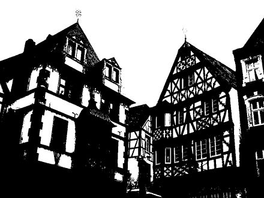

# otsu
[Otsu's Method](https://en.wikipedia.org/wiki/Thresholding_(image_processing)) is way of implementing automatic thresholding. It is a binarization algorithm which can be used to select the optimal threshold between foreground and background quantities based on finding the minimum point of [cross variance](). This is particularly useful when performing segmentation in [image processing]().

<a href="#badge">
    
</a>

<br />
<br />

<p align="center">
  
</p>

You can find an awesome description of the algorithm, which inspired this repository, [here](http://www.labbookpages.co.uk/software/imgProc/otsuThreshold.html).

## 🚀 Getting Started

Using [`npm`]():

```bash
npm install --save otsu
```

Using [`yarn`]():

```bash
yarn add otsu
```
## ✍️ Usage

It's really simple to find the threshold of your image. All you have to do is supply the data!

In the example below, we have a one-dimensional array of intensity data. Most greyscale image formats, such as [MNIST](http://yann.lecun.com/exdb/mnist/), can be fed directly into otsu this way. However, images that consist of multiple attributes per pixel (such as `(r,g,b)`) will first require pre-processing.

```javascript
import otsu from 'otsu';

const intensity = [255, 0, 128, 4, 95 ...];

const t = otsu(image);

console.log(t); // i.e. 128

const bw = image.map(e => (e > t ? 1 : 0));
```

## ✌️ License
[MIT](https://opensource.org/licenses/MIT)


<p align="center">
  <a href="https://www.buymeacoffee.com/cawfree">
    
  </a>
</p>
